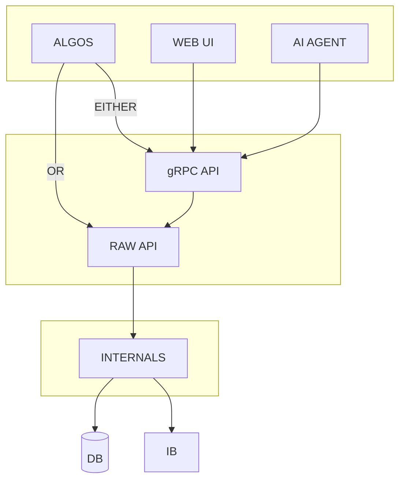

# TRADR

A stock/option trading application providing execution and management via API and web interface. 

Designed for direct algo integration (via the raw API) as well as AI agent control (via gRPC). Also provides a web interface for manual order execution and management.

`STATUS: Functional, but still in development -- use with a paper account.`

## Setup

If this is the first time setting up the app:

### Install Dependencies

1. Make the install, build, test, and start scripts executable:

   ```
   chmod +x install.sh build.sh test.sh start.sh
   ```

1. Run the install script

   ```
   ./install.sh
   ```

1. Look out for any final instructions output by the installer (e.g. to update env variables) and complete the TODO list before moving onto the next step.
   - One of the items in the TODO list will be to populate the generated `env.py` file. This contains important configuration values that must be populated in-order for the application to work properly. Read the IB section below for how to get the IB-related settings.

1. Ensure `envoy`, `npm`, `protoc`, and the necessary gRPC Web plugins are installed before moving onto the next step.
   - For Envoy, see http://envoyproxy.io/docs/envoy/latest/start/install
   - For the gRPC dependencies, see https://github.com/grpc/grpc-web?tab=readme-ov-file#code-generator-plugins
   - TODO: Add these to install script. Also add note to have Homebrew installed if on macOS.
   - TODO: Update this part once Dockerized.

1. Compile service dependencies

   ```
   ./build.sh
   ```

### Set Up IB to Accept API Connections

1.  Set up TWS or IB Gateway. The process is the same for paper or live accounts:
    - Either TWS or IB Gateway work just fine for this, and the process for API connection/setup for either is similar. The key difference between them is that TWS is a full trading platform while IB Gateway is a lighter-weight application focused on providing API access.

    For either, your goal is to do the following (from `Settings > API`):
    - Allow socket connections.
    - Disable _Read Only_ mode.
    - Get the Socket Port number and add it to the `env.py` file generated in the install step. Note that there will usually be two different port numbers for Live and Paper Trading mode. Update it when you change modes.
      - **IMPORTANT**: To sync orders made/updated in the IB UI (TWS), set Client ID in `env.py` to "0". If set to any other number, only orders made from the app (either programmatically or through the web UI) are visible.
    - Detailed reference article [here](https://interactivebrokers.github.io/tws-api/initial_setup.html).

    - **TWS**
      - Installation and API setup instructions [here](https://www.interactivebrokers.com/campus/trading-lessons/installing-configuring-tws-for-the-api)

    - **IB Gateway**
      - Download page [here](https://www.interactivebrokers.com/en/trading/ibgateway-stable.php)
      - Installation and API setup [here](https://www.interactivebrokers.com/campus/ibkr-quant-news/interactive-brokers-gateway-install-setup/)

1.  You can use `utils/setup_test.py` to verify connection settings. Edit it with your connection settings and run:

    ```
    source .requirements/bin/activate && python utils/setup_test.py
    ```

## Running the App

```
./start.sh
```

## Advanced Usage

Conceptually the system is structured as follows:

- **Interface Layer**: Where orders are triggered, managed, etc., by a human (through the web UI), algo(s) or AI agent.
- **API Layer**: Neatly wraps and provides access to the underlying mechanisms. Ideally methods exposed here will remain stable even with changes to the underlying mechanisms.
- **Lower Level Internals**: The majority of the system's functionality lies here (broker connection, order/contract management, event handling, etc.)



**IMPORTANT:**
The application relies on certain singleton resources that must not be duplicated, primarily the connection to IB and in-memory database.

This has practical implications on programmatic interaction with the API (i.e. any use case that bypasses the web UI -- algos, experiments, etc.).

### Scenario 1. The web UI is needed

If the web UI is needed, you must start the whole system (using the instructions from the `Running the App` section):

...then call the API via gRPC (you can't use the raw API in this case -- gRPC is pretty optimized anyway and only adds minor overhead):

#### grpc_client_example.py

```python
from client import TradingClient

with TradingClient("localhost:50057") as c:  # or whatever gRPC server address is declared in env.py
    resp = c.place_stock_order("AAPL", "BUY", 100)
    print(resp)

# OR, to match the raw API (see Scenario 2 example below)
api = TradingClient("localhost:50057")

resp = api.place_stock_order("AAPL", "BUY", 100)
print(resp)
```

This ensures a single IB session and consistent state shared by the UI and your scripts.

For convenience, the gRPC client method signatures match the raw API (e.g. `place_stock_order(symbol, side, quantity)`), and both return plain Python dicts.

### Scenario 2: The web UI is not needed

If you don’t need the web UI, you can work directly with the raw API as follows:

#### raw_api_example.py

```python
from runtime import get_app

app = get_app() # starts IB session, trackers, API, gRPC server (once per process)
api = app.api # same API used by the gRPC server

resp = api.place_stock_order("AAPL", "BUY", 100)
print(resp) # {'order_id': ..., 'broker_order_id': ..., 'status': 'SUBMITTED', 'message': ''}
```

Note that you can still make the calls over gRPC in this scenario (with _minor_ additional overhead).
